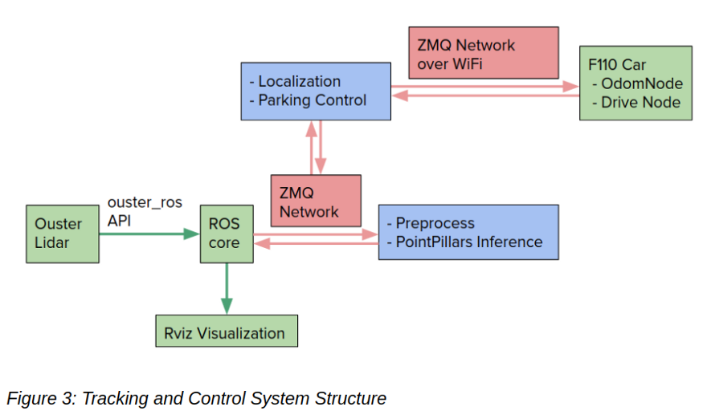
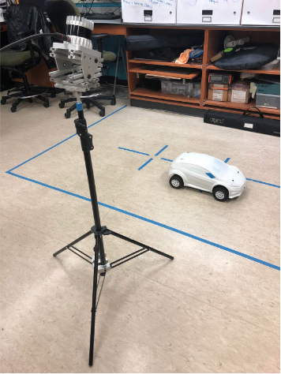

# F110-AVP
F110 Autonomous Valet Parking with Ouster LiDAR

[See the report](F110_AVP_Early_Progress_Report.pdf)

## Result
Demo with two f110 cars:


## Installation
1. Clone this repo.
2. Please refer to installation in [PointPillars](https://github.com/nutonomy/second.pytorch) repo to install dependencies for PointPillars. Our repo contains needed code from PointPillars so no need to clone theirs.
3. Install [SparseConvNet](https://github.com/facebookresearch/SparseConvNet) and [ros_numpy](https://github.com/eric-wieser/ros_numpy).
4. Install [ZeroMQ](http://wiki.zeromq.org/intro:get-the-software).
5. Be sure to add second.pytorch/ to your PYTHONPATH.

## Experimental Setup
System Structure:



Lidar is mounted on a tripod looking down on the cars:



## To Run the Experiment

### on Host
1. Connect the lidar to LAN and check host ip address. Run Ouster ROS node and open an rviz to check the point clouds.
```
cd avp_ws
source devel/setup.bash
roslaunch ouster_ros ouster.launch sensor_hostname:=os1-992006000706.local udp_dest:=[Host IP Address] lidar_mode:=2048x10 viz:=false
```

2. Run `lidar_zmq_node` and `visualization_node` with `avp_nodes.launch`. `lidar_zmq_node` preprocesses the point cloud and publishes it on ZMQ. `visualization_node` is for all visualization items to show on rviz. Please use the attached .rviz file.
```
cd avp_ws
source devel/setup.bash
roslaunch f110_avp avp_nodes.launch
```

3. Calibrate the point cloud to the setup. Refer to the report on how to get good detection results.
```
conda activate pointpillars
python3 ./avp_utils/f110_viewer.py
```

4. Run `detection.py` to start the pointpillars detection on the point cloud.
```
conda activate pointpillars
python3 -W ignore detection.py
```

5. Run `localization.py` to start the localization process and you should see bounding boxes in rviz now. Please refer to the report on the process of localization.
```
python3 localization.py
```
### on Vehicle
1. Copy `car_nodes/odom_zmq_node.py` and `car_nodes/drive_node.py` to the F110 car and compile them.

2. Run `teleop.launch`.

3. Run `odom_zmq_node` to send odometry data to the host computer.

4. After setting up way points, run `drive_node` to start navigating the car.
